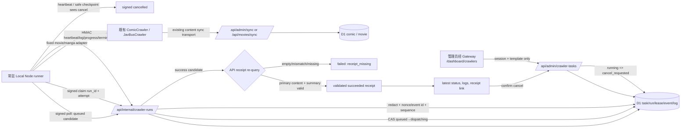

# Phase 17: Local Runner Vertical Slice - Research

**Researched:** 2026-07-30
**Domain:** 本地 Node runner、受控 crawler 适配、D1 receipt 验证与最小 Dashboard 任务面板
**Confidence:** HIGH（以当前仓库 Phase 16 契约和实现为主）

## User Constraints (from CONTEXT.md)

### Locked Decisions

- **D-01:** 本地 runner 是常驻 Node 进程，轮询 API 并 claim 由后台创建的任务；它只执行 API 分配的 run ID 和 registry 固定的视频/漫画模板。
- **D-02:** 一台本机同一时刻全局只运行一个 crawler 任务，避免 Puppeteer、网络和入库资源竞争。
- **D-03:** runner 离线时新任务保持 `queued`，runner 恢复后自动领取；离线本身不自动使任务失败。
- **D-04:** 视频和漫画两个固定模板都必须完成实际本地纵向执行验收。
- **D-05:** runner 回传的内容标识只是候选；API 必须重新查询并核验内容存在、模板匹配和入库摘要后才可将 run 标记为成功。
- **D-06:** 成功 receipt 保存一个经验证的主内容标识，以及新增、更新汇总；该主标识是跳转既有内容管理的稳定目标。
- **D-07:** crawler 正常退出但没有可核验入库内容时，run 必须以 `receipt_missing` 失败；空 receipt 不得被视为成功或部分成功。
- **D-08:** receipt 验收从既有内容管理跳转后，执行一次可回退编辑并读回确认，再恢复原值；不为本阶段销毁验收数据。
- **D-09:** runner 只在心跳与安全检查点发现 `cancel_requested` 后停止后续抓取，并用签名事件确认 `cancelled`；不强杀 crawler 子进程。
- **D-10:** Dashboard 取消操作必须二次确认，提交后显示“已请求取消，等待 runner 确认”，准确保留 `cancel_requested`。
- **D-11:** 取消前已实际入库的内容和审计摘要保留，但该 run 的终态仍为 `cancelled`，不产生成功 receipt。
- **D-12:** 用可控本地 crawler 步骤稳定验证取消协作；真实视频、漫画 crawl 另作实际纵向验收，避免将来源站时序作为取消测试的唯一依据。
- **D-13:** 在既有 `Crawlers.vue` 扩展最小任务面板，提供视频、漫画固定模板创建按钮，展示模板、最新 run 状态、取消、重试和 receipt 内容跳转；完整历史、筛选和细化运维体验留在 Phase 19。
- **D-14:** 页面可见时每 5 秒轮询状态与日志；创建、取消、重试成功后立即刷新。
- **D-15:** 默认显示最新 50 条结构化、已脱敏日志，并以游标“加载更多”分页；不使用实时流式推送。

### the agent's Discretion

- runner CLI 名称、轮询退避、API 路径、事件码、可控 crawler 的具体实现、测试 fixture 和已有 crawler 的薄适配器由实现决定。
- 这些实现必须遵守 Phase 16 已锁定的 HMAC、nonce、sequence、lease、状态机、日志容量与受控模板契约，并保持本地 canonical URL 为 Gateway `http://localhost:8080`。

### Deferred Ideas (OUT OF SCOPE)

- GitHub Actions workflow dispatch、provider run 关联、取消/补偿、最小权限令牌与生产重试：Phase 18。
- Dashboard 全量历史、筛选、详情体验、实时流式日志、统一运维 RUNBOOK 与生产/本地端到端收口：Phase 19。
- 多任务并发、实时流式日志、可配置通知、定时策略编辑、额外模板和自动重试：未来需求。

## Phase Requirements

| ID | Description | Research Support |
|----|-------------|------------------|
| LOCAL-01 | 本地 runner 使用 API 创建的 run ID 执行现有视频或漫画 crawler。 | 新的 runner 只轮询 API 的候选 run，并通过 API-owned template snapshot claim；`movie`/`manga` 分别接薄适配器，禁止把命令、URL 或配置交给 Dashboard。 |
| LOCAL-02 | 本地 runner 回写启动、心跳、日志、终态和入库 receipt，并支持协作取消。 | 复用 Phase 16 HMAC、nonce、event ID、sequence、lease 与状态机；增加 claim/poll，receipt 重查和受控取消检查点。 |
| LOCAL-03 | 本地任务可在 Gateway `http://localhost:8080` 观察状态、取消、重试和入库结果。 | 扩展 `Crawlers.vue`、typed dashboard API wrapper 与 admin task 查询；页面可见时 5 秒轮询，操作后即时刷新。 |
| DATA-01 | 成功任务必须记录可验证的入库摘要与内容标识；空或不匹配 receipt 不得标记成功。 | 以 API 端模板匹配的 D1 内容重查取代 runner 自报；将 validated primary ID 与 created/updated summary 写入已有 `receipt_summary_json`。 |

## Project Constraints (from AGENTS.md)

- 默认以中文沟通；Phase 计划与实施遵循 GSD 流程。
- 文档约束冲突时，以执行中的 `.planning/*` 为当前真相；稳定规则只回写其 canonical owner，不复制到多个 root 文档。
- 本地浏览器验收的 canonical URL 只能是 `http://localhost:8080/...`；`5173`、`8787` 等直连端口不得作为验收结论。
- 保留脏工作树和 Phase 13 历史未跟踪证据；只提交本 phase 明确拥有的文件。
- 实施前如改动函数、类或方法，先做 GitNexus impact analysis；HIGH/CRITICAL 先显式告警；提交前执行 `gitnexus detect-changes`。
- 文档只写 canonical owner；本 phase 不写 Phase 19 的 RUNBOOK 或完整运维文档。

## Summary

Phase 17 应交付一个独立的本地 Node runner，而不是让 Worker、Gateway 或 Dashboard 执行 Node/Puppeteer。它先从内部 API 得到 API-owned queued candidate，再用绑定 `run_id`、attempt、event ID、nonce、timestamp、sequence 的签名 claim 取得 lease，随后只从封闭 `movie`/`manga` registry 调用已有 crawler 薄适配器。[VERIFIED: codebase] 当前 `createCrawlerTaskRepository` 已具备 queued→dispatching、首心跳进入 running、CAS、lease、取消和终态不可逆基础；当前缺的是 runner poll/claim 和真正的本地执行器。

成功不能由 crawler 进程退出或 sync HTTP 200 推导。现有 `CrawlerRunReceipt` 只有 `contentIds` 与 `templateKey`，repository 直接把它序列化进 `receipt_summary_json`；这只证明候选格式正确，尚未证明内容实际存在或属于模板。[VERIFIED: codebase] Phase 17 应令 API 在处理 `succeeded` 前查询 `movie` 或 `comic`，验证主内容存在、模板对应、摘要非空，并持久化 validated primary ID 与新增/更新总数；重查失败转为 `failed/receipt_missing`，不写成功 receipt。

Dashboard 的范围是现有 `Crawlers.vue` 上的两个固定创建按钮、最近 run、50 条脱敏日志、取消/重试和 receipt 跳转。当前 task logs SQL 以升序读取并使用 `sequence > cursor`，会从最早日志开始且不能实现“加载更早”；应改为最新优先的 cursor 查询，再在 UI 中按时间顺序显示。[VERIFIED: codebase] 完整历史、筛选、实时推送和生产 workflow 继续留在 Phase 18/19。

**Primary recommendation:** 在 `packages/crawler` 新建 task-owned local runner/adapter 层；以签名 poll/claim + 现有签名事件驱动 Phase 16 状态机，并在 API repository 内完成 receipt 重查和 `receipt_missing` 失败化，不修改通用 `ApiClient` 的既有同步语义。

## Architectural Responsibility Map

| Capability | Primary Tier | Secondary Tier | Rationale |
|------------|--------------|----------------|-----------|
| 固定模板创建、取消、重试和任务读模型 | API / Backend | Database / Storage | 会话/资源权限与受控 template registry 必须在 API；D1 保存唯一控制面事实。 |
| queued run 的 poll/claim | API / Backend | Database / Storage | API 选择可领 run，并以 repository CAS 进行 `queued → dispatching`；runner 不得自行生成 run。 |
| 真实 movie/manga crawler 执行 | Local Node runner | Existing crawler package | Puppeteer、网络和 crawler 凭据只在本机 Node 数据面；单进程串行执行。 |
| HMAC 生命周期事件、日志和 receipt candidate | Local Node runner | API / Backend | runner 创建精确字节的签名 payload；API 验签、幂等、脱敏、状态转换与审计。 |
| receipt 内容重查与成功裁定 | API / Backend | Database / Storage | runner 的 ID 不可信；API 查 `movie`/`comic` 并写 validated summary 后才可成功。 |
| 取消协作 | API / Backend | Local Node runner | API 进入 `cancel_requested`；runner 在 heartbeat/安全检查点读到该状态并确认 `cancelled`，不强杀子进程。 |
| 最小任务面板、轮询和 CRUD 跳转 | Browser / Client | API / Backend | `Crawlers.vue` 展示可信读模型和 confirmation；API 保留访问控制与 mutation 判断。 |

## Standard Stack

### Core

| Library / Runtime | Version in repository | Purpose | Why Standard |
|-------------------|-----------------------|---------|--------------|
| Node.js | 24.x | 常驻本地 runner、精确 HMAC payload、现有 crawler/Puppeteer runtime | daily workflows 和当前开发机均使用 Node 24；不引入第二个 worker runtime。[VERIFIED: codebase] |
| TypeScript | 6.0.2 | runner event、receipt 和 adapter contract | 现有 monorepo 的语言与 strict type-check 路径。[VERIFIED: codebase] |
| Hono + Valibot | Hono 4.12.14 / Valibot 1.3.1 | 内部 runner API、管理员 task API、严格 envelope 校验 | Phase 16 已用 `Hono`、`validator` 与 Valibot schema 实现 callback 和 task routes。[VERIFIED: codebase] |
| Drizzle + Cloudflare D1 | Drizzle 0.45.2 | task/run/lease/event/log/receipt 与内容重查 | `crawler_task` domain 和内容表均在同一 D1；不新增队列或第二数据源。[VERIFIED: codebase] |
| Vue 3 + dashboard API wrapper | Vue 3.5.32 | `Crawlers.vue` 最小任务面板 | 复用已有认证、资源权限、`ConfirmDialog`、toast 和 `apiFetch` 模式。[VERIFIED: codebase] |

### Supporting

| Library / Runtime | Version in repository | Purpose | When to Use |
|-------------------|-----------------------|---------|-------------|
| `@starye/crawler` current `ComicCrawler` / `JavBusCrawler` | workspace package | 真正的漫画/视频抓取与既有入库 transport | 只从 local runner 的固定 adapter 调用；不从 Dashboard 或 Worker 调用。[VERIFIED: codebase] |
| Vitest | 4.1.4 | runner、repository、Hono route、Vue component unit tests | 每个状态/receipt/cursor/cancel 分支。[VERIFIED: local command] |
| Playwright | 1.59.1 | Gateway 下的最小 Dashboard + CRUD acceptance | 通过 `pnpm --filter dashboard exec playwright --version` 验证；只以 `http://localhost:8080` 检查真实页面交互。[VERIFIED: local command] |

### Alternatives Considered

| Instead of | Could Use | Tradeoff |
|------------|-----------|----------|
| 本地常驻 Node runner | Worker/Pages 执行 Puppeteer | 与锁定的 Cloudflare 执行边界冲突，且 Worker 不是现有 crawler runtime。[VERIFIED: CONTEXT.md] |
| D1 task/run + lease | BullMQ/Redis/Temporal/另一套队列 | 复制控制面、增加部署与恢复面，且与 Phase 16 的唯一事实源冲突。[VERIFIED: codebase] |
| 5 秒 polling | WebSocket/SSE | 实时流和完整运维体验明确延期到 Phase 19。[VERIFIED: CONTEXT.md] |
| task-owned crawler adapter | 改写 `ApiClient.syncMovie()` | `ApiClient` 是多处复用 transport；GitNexus 显示其被 smoke、target mutation、publisher/actor 与 optimized crawler 调用，通用语义不应为 task receipt 改写。[VERIFIED: codebase] |

**Installation:** 无。Phase 17 复用已锁定的 workspace 依赖，计划不得新增 npm 包。

**Version verification:** 当前开发机已验证 Node `v24.0.1`、pnpm `10.33.0`、Wrangler `4.90.1`、Vitest `4.1.4`、Playwright `1.59.1`；package 版本来自 live `package.json`，Playwright 必须经 dashboard workspace binary 调用。[VERIFIED: local command]

## Package Legitimacy Audit

不适用：Phase 17 不安装外部 package，因此无需 package-legitimacy gate。`ctx7` CLI 与 Context7 MCP 在本研究环境不可用；结论基于仓库现有受锁定依赖及实测版本，不以未验证的第三方文档替代代码事实。

## Architecture Patterns

### System Architecture Diagram



### Recommended Project Structure

```text
packages/crawler/src/task-runner/
├── local-runner.ts             # serial poll/claim loop and graceful process shutdown
├── runner-client.ts            # signed internal poll/claim/event client, single body serialization
├── event-signer.ts             # Node HMAC SHA-256 bytes compatible with API verifier
├── template-adapters.ts        # closed movie/manga registry; no argv URL/command/config input
├── movie-adapter.ts            # thin observation hook around current optimized crawler
├── manga-adapter.ts            # thin observation hook around current ComicCrawler
├── receipt-candidates.ts       # per-sync candidates and created/updated counters
└── controlled-adapter.ts       # deterministic safe checkpoints for cancellation tests
apps/api/src/domain/crawler-tasks/
├── receipt-validation.ts       # template-aware D1 re-query and validated receipt summary
└── repository.ts               # claim, CAS, outcome-aware event persistence, terminal receipt write
apps/api/src/routes/internal/crawler-runs/
└── index.ts                    # signed poll/claim plus existing signed events
apps/dashboard/src/views/
└── Crawlers.vue                # minimal task controls/read model only
```

`scripts/local-task-runner.ts` may be the explicit CLI wrapper, but it must be classified as a `local-or-external-only` entry in `crawler-source-entry-contract.test.ts`; do not add a second unconstrained crawler entry. [VERIFIED: codebase]

### Project-skill conventions

- Crawler adapter 不是新来源 strategy；若实施触及 parser，parser 必须保持无网络/无 Puppeteer 的纯函数，且 parser 测试用本地 HTML fixture，不能把真实网络抓取作为主测试。[VERIFIED: .agents/skills/starye-crawler-strategy]
- 若 receipt 需要 D1 schema/migration，先更新 Drizzle relations，再生成并应用本地迁移，随后构建 API types 和执行 API type-check。[VERIFIED: .agents/skills/starye-db-migration]
- 新增 API route 时在 `apps/api/src/schemas/` 定义 Valibot request/response schema，以 `app.openapi()` 公开并挂入 `apps/api/src/app.ts`；Dashboard 仅通过 typed API wrapper 调用。[VERIFIED: .agents/skills/starye-hono-rpc]
- `Crawlers.vue` 复用已有 UI 基础组件与 Tailwind token，不在本阶段新建视觉基础设施或硬编码孤立颜色。[VERIFIED: .agents/skills/starye-ui-components]

### Pattern 1: Signed poll → claim → lifecycle event sequence

**What:** Poll is read-only and returns only API-owned queued candidate metadata. Claim is an HMAC-signed, run-bound event that atomically moves exactly that run from `queued` to `dispatching`; heartbeat begins at the next sequence and transitions it to `running`.[VERIFIED: codebase]

**When to use:** Every local runner loop iteration. It preserves D-01, D-02, D-03 and Phase 16 sequence/lease rules.[VERIFIED: CONTEXT.md]

**Implementation rules:**

1. The candidate response contains `runId`, attempt and frozen `CrawlerTaskSnapshot` only; never command, arbitrary URL, workflow, target profile, credentials or environment.[VERIFIED: CONTEXT.md]
2. Reuse the current raw-body HMAC header shape: `x-runner-key-id` plus `x-runner-signature`. The Node client serializes once, signs those exact bytes and sends those exact bytes.[VERIFIED: codebase]
3. Reuse `claimDispatch()`/state-machine CAS for the state change. A stale claim must report its actual stale/rejected outcome rather than a stored `accepted` replay response.[VERIFIED: codebase]
4. The runner holds one in-memory active run. It does not poll/claim another until the current adapter emits a signed terminal event and returns to idle.[VERIFIED: CONTEXT.md]

```ts
// Source: apps/api/src/routes/internal/crawler-runs/index.ts and runner-event-auth.ts
const body = JSON.stringify({
  attempt: candidate.attempt,
  event_id: crypto.randomUUID(),
  key_id: runnerKeyId,
  nonce: crypto.randomUUID(),
  run_id: candidate.runId,
  sequence: 1,
  timestamp: Date.now(),
  type: 'claim', // Phase 17 extension: maps only to repository.claimDispatch()
})
const signature = createHmac('sha256', runnerSecret).update(body).digest('base64url')
await fetch(`${apiOrigin}/api/internal/crawler-runs/${candidate.runId}/events`, {
  body,
  headers: {
    'content-type': 'application/json',
    'x-runner-key-id': runnerKeyId,
    'x-runner-signature': signature,
  },
  method: 'POST',
})
```

### Pattern 2: Task-owned sync observation, not transport replacement

**What:** Both fixed adapters observe successful content-sync calls and collect only non-sensitive candidate IDs plus created/updated counters. The runner does not infer success from `run()` returning: `ComicCrawler.run()` catches crawl errors internally, while `OptimizedCrawler` can treat an individual failed movie as `null`.[VERIFIED: codebase]

**When to use:** During each real movie/manga template execution and the deterministic controlled cancellation adapter.[VERIFIED: CONTEXT.md]

**Implementation rules:**

- Keep `ApiClient.syncMovie()` unchanged. Its current callers include Phase 13 smoke, prepared target mutation, actor/publisher crawlers and the optimized crawler.[VERIFIED: codebase]
- Add a narrow observation hook at the crawler class boundary: movie must expose the data that reached `syncMovie`; manga must observe `syncToApi('/api/admin/sync', { type: 'manga', data })`. The hook records only template-compatible candidate IDs and counter facts.[VERIFIED: codebase]
- The adapters return `{ outcome: 'completed' | 'cancelled', candidates, summary }`, never a raw stdout/HTML/cookie/header dump.[VERIFIED: CONTEXT.md]
- A real template has no candidate after normal completion → emit signed `failed` with code `receipt_missing`; do not emit `succeeded`.[VERIFIED: CONTEXT.md]

### Pattern 3: API-side receipt revalidation before terminal success

**What:** Convert a runner candidate into a `ValidatedCrawlerRunReceipt` in the repository/domain layer. For movie, re-query `movie.id` (and verified code/ingest fields); for manga, re-query `comic.id` (and verified slug/ingest fields). The receipt writer chooses one stable primary ID and stores `templateKey`, `primaryContentId`, `createdCount`, `updatedCount`, and a minimal verified aggregate in existing `crawler_run.receipt_summary_json`.[VERIFIED: codebase]

**When to use:** Only for a signed `succeeded` event after HMAC, timestamp, nonce/event ID, attempt and sequence validation.[VERIFIED: codebase]

```ts
// Source: packages/db/src/schema.ts and apps/api/src/domain/crawler-tasks/repository.ts
const validated = await validateReceiptCandidate({
  candidate: event.receipt,
  database: c.get('db'),
  templateKey: run.templateKey,
})

if (!validated.ok) {
  // Terminal failure; retain prior content and audit but never write success receipt.
  return repository.applyTransition(run.id, {
    actor: 'runner', sequence: event.sequence, type: 'runner_failed',
  }, { safeSummary: 'receipt_missing' })
}

return repository.applyTransition(run.id, {
  actor: 'runner', receipt: validated.receipt, sequence: event.sequence, type: 'runner_succeeded',
})
```

### Pattern 4: Cooperative cancellation at safe checkpoints

**What:** The runner continues heartbeat while a crawler unit is in flight. At the next adapter-defined safe checkpoint it fetches the run state; if `cancel_requested`, it skips future work and sends signed `cancelled` without a success receipt.[VERIFIED: CONTEXT.md]

**When to use:** At unit boundaries (before a next movie/manga unit) and heartbeat ticks. Use `controlled-adapter.ts` to make this timing deterministic in tests.[VERIFIED: CONTEXT.md]

**Rules:** Do not call `process.kill`, do not abort a Puppeteer process, do not erase already ingested data. Preserve the existing `cancel_requested + valid success receipt => succeeded/cancel_not_effective` state-machine priority.[VERIFIED: codebase]

### Pattern 5: Latest-first log cursor and visible-page polling

**What:** The API returns logs in reverse sequence order with `nextCursor` equal to the oldest returned sequence. `Crawlers.vue` requests 50 newest entries initially and uses `sequence < cursor` for older pages; render sorted ascending if chronological display is desired.[VERIFIED: CONTEXT.md]

**When to use:** Current selected/latest run only. Poll every five seconds while the document is visible; stop interval on unmount/hidden and reload immediately after create/cancel/retry.[VERIFIED: CONTEXT.md]

**Anti-Patterns to Avoid**

- **Use `target-crawl-mutation.ts` as a local runner:** it is a remote prepared child and currently rejects every crawler operation except `crawler-smoke-fixture`; widening it would violate its prepared-context boundary.[VERIFIED: codebase]
- **Make the dashboard hand a shell command or URL to runner:** violates the closed template registry and allows bypass of target/secret boundaries.[VERIFIED: CONTEXT.md]
- **Write a new status machine in the runner:** repository `decideCrawlerRunTransition()` is the single lifecycle authority.[VERIFIED: codebase]
- **Persist crawler stdout/HTML/headers for debugging:** Phase 16 limits storage to structured, redacted logs (4 KiB/event, 500 ordinary rows).[VERIFIED: codebase]
- **Convert cancel request straight to cancelled in the UI:** only queued cancellation is immediate; dispatched/running work must visibly remain `cancel_requested` until runner confirmation.[VERIFIED: CONTEXT.md]

## Don't Hand-Roll

| Problem | Don't Build | Use Instead | Why |
|---------|-------------|-------------|-----|
| Queue/lease/state machine | in-memory queue, filesystem lock, second status enum | existing `crawler_task` repository, lease and `decideCrawlerRunTransition` | D1 CAS, immutable attempts, race audit and terminal semantics already exist.[VERIFIED: codebase] |
| Runner callback signing | custom token or reuse `CRAWLER_SECRET` | existing HMAC verifier/key rotation headers, mirrored by Node signer | Separate callback secret, 5-minute window, nonce/event ID and exact raw-body verification are already contractually fixed.[VERIFIED: codebase] |
| Receipt proof | process exit code or arbitrary JSON receipt | API-side template-aware D1 re-query | Only D1 can prove content persistence and stable content ownership.[VERIFIED: codebase] |
| UI confirmation | `window.confirm` or optimistic `cancelled` label | existing `ConfirmDialog` and route result | Current Crawler page already uses this dialog pattern; it preserves cancellation semantics.[VERIFIED: codebase] |
| Log transport/storage | console dump, custom stream, unbounded table | Phase 16 structured redacted event/log pipeline | Keeps credentials and source data out of D1 and Dashboard.[VERIFIED: codebase] |
| Local browser acceptance | direct Vite/API ports | Gateway `http://localhost:8080` | Repository canonical local routing and session behavior are Gateway-owned.[VERIFIED: AGENTS.md] |

**Key insight:** Phase 17 is an adapter and proof phase. The difficult state, security and persistence mechanics already exist; implementation should connect them without adding a parallel runner protocol, task store or crawler transport.

## Common Pitfalls

### Pitfall 1: A claim is accepted twice or reports `accepted` after a rejected transition

**What goes wrong:** `processRunnerEvent()` currently records a caller-provided accepted outcome before `applyTransition()`. A future claim/stale success can therefore return a stored accepted result even when the state transition did not occur.[VERIFIED: codebase]

**How to avoid:** Compute and persist the actual transition outcome transactionally/after CAS; map stale/rejected/invalid receipt to a non-success response and retain only an audit record. Add duplicate, conflicting nonce/event ID and stale-claim route tests.

### Pitfall 2: Treating crawler completion as receipt success

**What goes wrong:** `ComicCrawler.run()` catches its own failure and both crawler implementations may complete without an observable persisted item. `ApiClient.sync()` also returns `null` for transport failures.[VERIFIED: codebase]

**How to avoid:** Use adapter-collected candidates and API D1 revalidation; empty/missing/mismatched candidates terminate as `receipt_missing`.

### Pitfall 3: Receipt validation ignores template identity or content summary

**What goes wrong:** A syntactically non-empty `contentIds` list can reference the wrong table/template or describe no verified ingestion.

**How to avoid:** Validate candidate against the run's frozen `templateKey`; query only the corresponding `movie`/`comic` record; persist primary ID and created/updated aggregate only after all checks pass.

### Pitfall 4: Cancellation destroys current work or falsely reports terminal cancellation

**What goes wrong:** Killing Puppeteer or immediately showing `cancelled` loses auditability and breaks the Phase 16 race rule.

**How to avoid:** Poll cancellation through heartbeat/safe checkpoints, stop only before future units, send signed `cancelled`, and retain pre-cancel ingress without a success receipt.

### Pitfall 5: Logs show the oldest 50 and “load more” moves forward

**What goes wrong:** Current `ORDER BY sequence ASC` plus `sequence > cursor` has the inverse direction of D-15.[VERIFIED: codebase]

**How to avoid:** Query latest-first with `sequence < oldestCursor`, return explicit cursor metadata, and test first page plus second page contains no overlap.

### Pitfall 6: Reopening Phase 13 remote entry points for local execution

**What goes wrong:** The target-prepared mutation layer intentionally confines remote crawlers and smoke fixtures; altering it for this runner risks target-profile/credential regressions.

**How to avoid:** Keep the local runner as a separate, locally configured process with fixed adapters. Reuse content crawler classes, not Phase 13 remote mutation plumbing.

### Pitfall 7: Receipt link reaches a list but not an editable resource

**What goes wrong:** Movies have `GET /admin/movies/:id`, but the comics management route currently exposes a list rather than an equivalent direct detail lookup.[VERIFIED: codebase]

**How to avoid:** Add a small, resource-guarded `GET /admin/comics/:id` if required and make `Movies.vue`/`Comics.vue` consume an explicit receipt query parameter to load/open their existing edit modal. The acceptance test must update one reversible field, read it back, then restore it.

## Code Examples

### Visibility-safe polling

```ts
// Source: apps/dashboard/src/views/Crawlers.vue lifecycle pattern
let timer: ReturnType<typeof setInterval> | undefined

function startVisiblePolling() {
  stopVisiblePolling()
  if (document.visibilityState === 'visible')
    timer = setInterval(() => void refreshTaskPanel(), 5_000)
}

function stopVisiblePolling() {
  if (timer) clearInterval(timer)
  timer = undefined
}

document.addEventListener('visibilitychange', () => {
  if (document.visibilityState === 'visible') {
    void refreshTaskPanel()
    startVisiblePolling()
  }
  else {
    stopVisiblePolling()
  }
})
```

### Correct latest-log cursor contract

```sql
-- Source: adapted from apps/api/src/routes/admin/crawler-tasks/index.ts
SELECT sequence, level, code, safe_message, counts_json, created_at
FROM crawler_run_log
WHERE run_id = ?
  AND (? IS NULL OR sequence < ?)
ORDER BY sequence DESC
LIMIT ?;
-- response.nextCursor = final row's sequence, if a final row exists
```

### Controlled cancellation adapter shape

```ts
// Source: Phase 17 D-09/D-12 and existing signed runner-event envelope
for (const checkpoint of controlledSteps) {
  await events.heartbeat({ code: 'runner_heartbeat' })
  if (await runnerClient.isCancelRequested(runId)) {
    await events.cancelled({ code: 'cancelled_at_safe_checkpoint' })
    return { outcome: 'cancelled', candidates: [], summary: { created: 0, updated: 0 } }
  }
  await checkpoint.run()
}
```

## State of the Art

| Old Approach | Current Approach | When Changed | Impact |
|--------------|------------------|--------------|--------|
| `/api/admin/crawlers/recover` returns manual/local-or-Actions instructions and filesystem failure-task prose | Phase 16 `crawler_task`/`crawler_run` control plane with signed callback routes | Phase 16 | Phase 17 must drive the task domain rather than extend manual recovery instructions.[VERIFIED: codebase] |
| Phase 13 `target-crawl-mutation` prepared remote entry | local task-owned runner and thin adapters | Phase 17 | Keeps local runner outside remote target mutation and preserves its closed smoke-only guard.[VERIFIED: codebase] |
| non-empty runner `contentIds` stored as receipt summary | API-revalidated primary content ID plus verified summary | Phase 17 | Enforces DATA-01 and D-05–D-07.[VERIFIED: CONTEXT.md] |

**Deprecated/outdated for this phase:**

- Treating `apps/api/src/routes/admin/crawlers` filesystem failure-task endpoints as task execution control is obsolete for Phase 17. Retain the existing statistics section, but build the vertical slice on `/api/admin/crawler-tasks`.[VERIFIED: codebase]

## Assumptions Log

All material implementation claims are verified against the current codebase. No external package, provider or compliance claim is required for this local-only phase.

## Open Questions

1. **Local runner credential placement**
   - What we know: callback key IDs/secrets are typed as API bindings; current local API/Gateway services are already running on 8080/8787/5173, and user secrets are excluded from target-managed public projections.[VERIFIED: codebase]
   - What's unclear: the exact ignored local file/launcher convention for the runner's callback secret and existing crawler credentials.
   - Recommendation: planner adds a local-only documented env contract that loads from ignored local config, never logs values, and does not change public/runtime projection files.

2. **Actual crawler preset construction**
   - What we know: `ComicCrawler` and `JavBusCrawler` exist, while the currently allowed prepared remote child only runs `crawler-smoke-fixture`.[VERIFIED: codebase]
   - What's unclear: which current source/config preset should be bound to each local fixed template without exposing URL/config inputs.
   - Recommendation: build the preset entirely in the local template registry and prove both adapters with a bounded real local run; do not accept it from CLI/API/UI.

## Environment Availability

| Dependency | Required By | Available | Version / observed state | Fallback |
|------------|-------------|-----------|--------------------------|----------|
| Node.js | local runner and crawler adapters | ✓ | v24.0.1 [VERIFIED: local command] | — |
| pnpm | workspace scripts | ✓ | 10.33.0 [VERIFIED: local command] | — |
| Wrangler | local API/D1 runtime | ✓ | 4.90.1 [VERIFIED: local command] | — |
| Playwright | Gateway acceptance | ✓ | 1.59.1 via `pnpm --filter dashboard exec` [VERIFIED: local command] | unit/component tests only if browser is not needed during intermediate work |
| workspace dependencies | API/dashboard/crawler tests | ✓ | `node_modules` present [VERIFIED: local command] | — |
| Gateway/API/Dashboard | local acceptance | ✓ | 8080/8787/5173 listening at research time [VERIFIED: local command] | supervisor in `scripts/local-dev.ts` |

**Missing dependencies with no fallback:** none observed.

**Missing dependencies with fallback:** none observed.

## Security Domain

### Applicable ASVS Categories

| ASVS Category | Applies | Standard Control |
|---------------|---------|-----------------|
| V2 Authentication | Yes | Dashboard task commands require Better Auth session; runner callbacks use current/previous key-id HMAC validation.[VERIFIED: codebase] |
| V3 Session Management | Yes | Dashboard remains Gateway/session-cookie mediated; runner has no browser session and gets only callback secret locally.[VERIFIED: codebase] |
| V4 Access Control | Yes | `canAccessCrawler` maps movie/comic template and content route access; receipt links preserve resource boundary.[VERIFIED: codebase] |
| V5 Input Validation | Yes | strict Valibot task/event schemas; closed template registry; reject unknown command/URL/workflow/env/secret fields.[VERIFIED: codebase] |
| V6 Cryptography | Yes | reuse HMAC-SHA-256 raw-body verifier, timestamp window, nonce/event-id idempotency and key rotation; no custom crypto format.[VERIFIED: codebase] |
| V7 Error Handling | Yes | safe structured error codes/messages only; no crawler stdout, headers, source URLs or secret values in response/logs.[VERIFIED: codebase] |

### Known Threat Patterns for this Stack

| Pattern | STRIDE | Standard Mitigation |
|---------|--------|---------------------|
| forged/replayed runner event | Spoofing / Replay | HMAC over exact body, key ID, 5-minute timestamp, run/attempt binding and nonce/event ID outcome replay handling.[VERIFIED: codebase] |
| stale concurrent claim | Tampering | D1 state-version/sequence CAS and one in-memory active run; never dequeue client-side.[VERIFIED: codebase] |
| template or command injection | Elevation of Privilege | API-owned registry returns only movie/manga snapshot; no free-form runner input.[VERIFIED: CONTEXT.md] |
| receipt points at wrong content | Tampering | API re-queries template-specific `movie`/`comic`, validates primary ID and summary before success.[VERIFIED: CONTEXT.md] |
| sensitive diagnostic leakage | Information Disclosure | `normalizeRunnerEventForStorage`, 4 KiB cap, redaction and Dashboard rendering only stored safe fields.[VERIFIED: codebase] |
| cancel race erases ingestion history | Repudiation / Tampering | immutable transitions, retained audit summary, cooperative terminal event, no forced kill.[VERIFIED: codebase] |

## Sources

### Primary (HIGH confidence)

- [`.planning/phases/17-local-runner-vertical-slice/17-CONTEXT.md`](17-CONTEXT.md) - locked scope and acceptance decisions.
- [`apps/api/src/domain/crawler-tasks/repository.ts`](../../../apps/api/src/domain/crawler-tasks/repository.ts) - D1 CAS, leases, runner-event idempotency, receipt persistence and current outcome ordering.
- [`apps/api/src/domain/crawler-tasks/state-machine.ts`](../../../apps/api/src/domain/crawler-tasks/state-machine.ts) - lifecycle, cancel race and terminal constraints.
- [`apps/api/src/routes/internal/crawler-runs/index.ts`](../../../apps/api/src/routes/internal/crawler-runs/index.ts) - current raw-body HMAC callback boundary.
- [`apps/api/src/routes/admin/crawler-tasks/index.ts`](../../../apps/api/src/routes/admin/crawler-tasks/index.ts) - task command/query/log API and current cursor behavior.
- [`packages/db/src/schema.ts`](../../../packages/db/src/schema.ts) - task/run/log schemas and movie/comic content tables.
- [`packages/crawler/src/crawlers/comic-crawler.ts`](../../../packages/crawler/src/crawlers/comic-crawler.ts), [`packages/crawler/src/core/optimized-crawler.ts`](../../../packages/crawler/src/core/optimized-crawler.ts) - actual crawler execution/error-observation limits.
- [`apps/dashboard/src/views/Crawlers.vue`](../../../apps/dashboard/src/views/Crawlers.vue) and [`apps/dashboard/src/lib/api.ts`](../../../apps/dashboard/src/lib/api.ts) - existing UI lifecycle, confirmation and API-wrapper patterns.
- [`scripts/local-dev.ts`](../../../scripts/local-dev.ts) - local Gateway/API/Dashboard supervisor and canonical gateway topology.

### Secondary (MEDIUM confidence)

- GitNexus refresh and queries on 2026-07-30: `createCrawlerTaskRepository`, `ApiClient`, task runner/receipt flows. Impact checks report LOW risk for `OptimizedCrawler` (3 direct references), `ComicCrawler` (1) and `createCrawlerTaskRepository` (3), with zero currently indexed execution flows affected.

### Tertiary (LOW confidence)

- None. Context7 MCP and `ctx7` CLI were unavailable, so no external documentation claim is used.

## Metadata

**Confidence breakdown:**

- Standard stack: HIGH - every component is present in workspace manifests or observed locally.
- Architecture: HIGH - constrained by current Phase 16 repository/state machine, task routes and local supervisor.
- Pitfalls: HIGH - each maps to an observed current behavior or locked Phase 17 decision.

**Research date:** 2026-07-30
**Valid until:** 2026-08-29 (refresh if Phase 16 task-domain contracts or runner callbacks change first).
