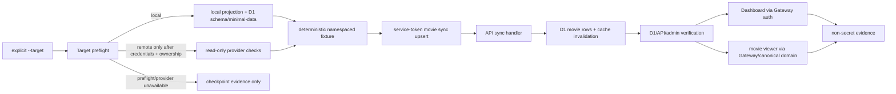

# Phase 13: Full Chain Data Smoke - Research

**Researched:** 2026-07-16
**Phase:** 13 - Full Chain Data Smoke
**Status:** Ready for planning

<user_constraints>
## Phase Boundary

证明 selected target 可通过受控的 local-first 和 production smoke 跑通一条真实、可重复的数据链：受限 crawler 或 fixture 写入一个已知条目，随后在 D1/API、Dashboard 管理态和经由 Gateway/canonical domain 的前台查看中证明同一条目存在。所有远程执行都必须在显式 target、资源归属和凭据检查通过后才可开始，并输出不含密钥的证据。

**In scope（本 phase 收口）：**

- `http://localhost:8080/...` 下的 local Gateway/API/auth/dashboard/content smoke，以及 local D1 schema/minimal-data 就绪检查。
- 以 deterministic、namespaced 的 smoke item 身份执行受限 crawler 或 fixture ingest，并记录 resulting item identity。
- 在 selected target 上执行 production data-chain smoke，证明同一 item 可由 D1/API、Dashboard 和 canonical Gateway public viewer 读取或管理。
- 为 local 与 production 生成可重复、non-secret 的 run/target/item evidence artifact，并让 smoke scripts 产生稳定输出。

**Out of scope（本 phase 明确不做）：**

- 全量 crawler corpus、无边界 bulk ingest 或为 smoke 新增常态数据运营能力。
- 旧 `starye.org` 字面量清理、RUNBOOK 最终切换/恢复文档与 v1.2 最终 requirement-to-evidence matrix，属于 Phase 14。
- 伪造 production 成功、绕过 target preflight、把 credential/endpoint/raw prepared context 写进计划或证据。

## Implementation Decisions

### Smoke Item And Ingest Boundary

- **D-01:** 本轮 crawler 验收使用固定、闭合、deterministic 的 10 条 non-R18 smoke fixture 集合；每条携带 namespace/target/run 语义且只有一个 player。primary item 保持为 local/production evidence 和 Dashboard→Viewer 的唯一 correlation tuple，其余 9 条仅作为 D1/API 数量审计的 supporting records。不得依赖人工随机选择现有内容，也不得扩大为完整 crawler corpus。
- **D-02:** 写入只允许受限 crawler 或 fixture adapter；禁止用完整 crawler corpus 作为 release gate。planner 可根据当前受控 entry 和可用凭据选择 fixture 或 targeted crawler，但必须保持最小数据量、可重跑和明确 target。

### Local-First Execution Order

- **D-03:** production 尝试前必须先验证 local D1 schema 与 minimal data，再经 `http://localhost:8080/...` 执行 local API、auth/dashboard 和 content route smoke；3000/3001/3002/3003/5173 等直连端口只能作为实现诊断，不得充当 canonical evidence URL。
- **D-04:** local 与 production 都验证同一 smoke item：D1/API 可查、Dashboard 可管理或校验、public viewer 可通过 Gateway/canonical domain 读取。production browser/public evidence 只能使用 selected target 的 canonical domain。

### Remote Checkpoint And Evidence

- **D-05:** 所有 production 或 provider-side data-chain 命令必须显式选择 target，并先通过 target preflight、credential-key presence、account/resource ownership 和 read-only live checks；任一凭据或 provider access 缺失时 fail closed，记录 checkpoint evidence，绝不模拟或声称 production 成功。
- **D-06:** 每次 smoke 产生 repeatable local/production evidence artifact，至少包含 non-secret target ID、run ID/timestamp、fixture/item identity、验证 surface、URL/path 和 pass/fail/checkpoint 状态；禁止写入 secrets、tokens、完整 remote endpoints 或 raw prepared context。
- **D-07:** 真实 provider/data-chain execution 与其结果证据属于 Phase 13；Phase 14 才负责 source literal cleanup、RUNBOOK 稳定化和最终全量 evidence mapping，避免把真实链路缩减为仅文档或静态 contract。
</user_constraints>

## 摘要

- Phase 13 的主路径应是一个小而真实的电影 fixture：固定 namespace 与 target/run 派生业务 code，走现有 service-token sync API 的 `upsert`，再以返回的业务 code/ID 关联 D1、API、Dashboard 与 movie viewer。不要选择既有随机内容，也不要启动完整 crawler corpus。 [VERIFIED: `13-CONTEXT.md`; `packages/crawler/src/utils/api-client.ts`; `apps/api/src/routes/movies/handlers/sync.handler.ts`]
- Phase 12 已经交付显式 target、预检和封闭 prepared-entry 边界，但当前 crawler prepared child 对真实操作明确抛出 `target runner execution adapter` 缺失错误。因此 Phase 13 必须在该受控 seam 上补一个专用 smoke fixture adapter/entry，不能绕过 registry 直接调用 crawler 或带环境变量拼接远端。 [VERIFIED: `packages/config/src/deployment-target/mutation-entry.ts`; `scripts/target-remote-entry.ts`; `packages/crawler/scripts/target-crawl-mutation.ts`]
- 当前本机 shell 中 `CLOUDFLARE_API_TOKEN`、`CLOUDFLARE_ACCOUNT_ID`、`CRAWLER_SECRET`、`API_URL` 与 R2 相关键均不存在；同时 `pnpm target-profile project-local --target starye-org --check` 在四个 local consumer 上报 target-managed projection mismatch。研究期间没有执行任何 provider、D1、R2、crawler、部署或回滚命令。故当前事实只支持 fail-closed checkpoint，不支持任何 local-ready 或 production-passed 声明。 [OBSERVED: 2026-07-16 non-secret key-presence audit; local projection check]
- `pnpm target-profile validate --target starye-org` 已通过，证明非敏感 target profile 可解析；这不证明 local env、D1 schema、Gateway 服务、管理员会话或 provider access 已就绪。 [OBSERVED: 2026-07-16 CLI result]
- 真实 production proof 必须在 Phase 13 由获授权的目标与 provider access 实际执行；若缺少前置条件，唯一合法结果是写入 `checkpoint` evidence。任何 localhost 模拟、fixture-only unit test 或手写成功 JSON 都不能替代 production evidence。 [LOCKED: D-05, D-07]

<phase_requirements>
| Requirement | 计划必须交付 | 强证据 |
|---|---|---|
| DATA-01 | Local smoke 只以 `http://localhost:8080/...` 验证 API、auth/dashboard 与 movie content 路径。 | 同一 run 的 Gateway URL/path、HTTP/UI 结果和 artifact；无 direct-port canonical URL。 |
| DATA-02 | 先确认 local D1 schema 与 minimal data，再开始 local ingest。 | 本地 migration/schema query 和 fixture 前置结果写入 evidence。 |
| DATA-03 | 受控 fixture 或 targeted crawler 只写入一个 deterministic namespaced item，并记录 resulting business ID 与 DB ID。 | Ingest result 与 identity record 可交叉关联。 |
| DATA-04 | 对同一 item 证明 D1、sync/public API 和 admin state 都可查询。 | D1/API/admin 三个 surface 的同一 target/run/item tuple。 |
| DATA-05 | 通过 Gateway-relative Dashboard、真实授权会话管理或验证该 item。 | Dashboard route/result 与 session-gated status；不可用时明确 checkpoint。 |
| DATA-06 | 通过 selected target 的 canonical Gateway movie path 查看该 item。 | Local 为 `http://localhost:8080/movie/<code>`；remote 仅 selected canonical domain。 |
| DATA-07 | Local 与 remote 都产生 schema-validated、non-secret、可重跑 evidence。 | JSON machine record 加 Markdown run summary，包含 target/run/item/surface/status。 |
| TEST-05 | Smoke runner 对 pass、blocked/checkpoint、identity mismatch 和 secret redaction 都有自动回归。 | Vitest + runner contract tests；稳定 exit code 与无敏感字段输出。 |
</phase_requirements>

## 架构责任图

| Layer | 已有责任 | Phase 13 计划责任 | 关键来源 |
|---|---|---|---|
| Target identity | 解析显式 tracked target，拒绝默认/legacy alias。 | 所有 local/remote runner 都接收 `--target`；evidence 只记录 target ID。 | `target-resolver.ts`, `preflight.ts` |
| Preflight / ownership | `smoke` 是已注册 high-risk command；remote 要求 credential key、account match 和只读 live checks。 | 远程写入前调用现有 preflight；失败只生成 checkpoint，绝不进入 ingest。 | `preflight.ts`, `live-checks.ts` |
| Prepared mutation boundary | registry 固定 child module/operation；fresh allowlisted child environment，禁 ambient target identity。 | 增加一个最小 smoke fixture entry/adapter，而不是新增自由 argv 或 direct remote crawler command。 | `mutation-entry.ts`, `target-remote-entry.ts` |
| Controlled ingest | `ApiClient.syncMovie()` 以 service token POST 单个 movie 的 upsert payload。 | fixture adapter 使用这个 payload contract，并将 item identity 从 response/lookup 传给 verifier。 | `api-client.ts`, `api-client.test.ts` |
| API -> D1 | `/api/movies/sync` 受 `serviceAuth()` 保护，handler 调 service 执行 upsert 并清 Gateway movies cache。 | 对 fixture 的 code/ID 做 D1、admin/public API 一致性检查；不创建平行写入路径。 | `apps/api/src/routes/movies/index.ts`, `sync.handler.ts` |
| Dashboard | Hono RPC base URL 是 Gateway-relative，包含 cookie credentials；`/dashboard/movies` 受角色保护。 | 浏览器/会话 smoke 验证管理态，不伪造管理员 cookie 或绕过 Gateway。 | `hono-rpc-client.ts`, `apps/dashboard/src/router/index.ts` |
| Public viewer | movie app 以相对 `/api` Hono RPC 请求 public movie detail，router 详情页为 `/movie/:code`。 | 用 non-R18 fixture 经 Gateway 对应页面和 API 同时读取该 code。 | `apps/movie-app/src/lib/api-client.ts`, `apps/movie-app/src/router.ts` |
| Gateway | local `/api`、`/dashboard`、`/movie` 均经过 8080；dashboard 有前置 auth guard。 | 所有浏览器证据只记录 Gateway/canonical path；direct ports 仅诊断。 | `apps/gateway/src/index.ts`, `AGENTS.md` |
| Evidence | 尚无 Phase 13 full-chain evidence runner。 | 一个受 schema 约束的 writer 输出 JSON + Markdown；remote 失败也落明确 checkpoint。 | [GAP: repository search 2026-07-16] |

## 系统与数据流



### Required execution order

1. Resolve `starye-org` explicitly and make `project-local --check` pass; the current check is a hard local precondition, not an optional warning. [OBSERVED: 2026-07-16]
2. Apply/check local D1 schema and minimal data, then start the local stack. The repository standard says local browser validation goes through Gateway. [VERIFIED: `packages/db/MIGRATION.md`; `README.md`; `AGENTS.md`]
3. Run one deterministic fixture ingest, capture the created business code and database ID, then verify D1/API/admin/public viewer with that same tuple. [LOCKED: D-01..D-04]
4. Only after the local evidence passes, attempt remote `smoke` preflight with explicit target and read-only checks. [LOCKED: D-03, D-05]
5. If remote preflight and authorized provider access pass, run the same target-scoped fixture and selected canonical-domain checks. Otherwise write a checkpoint artifact that names the missing gate category but not a secret or endpoint. [LOCKED: D-05..D-07]

## 现有标准栈：只复用，不新增依赖

| Need | Reuse | Planning rule |
|---|---|---|
| CLI / orchestration | TypeScript + `tsx` via existing `pnpm` workspace scripts | Add one narrow root/package script only if it delegates to tested modules. No shell-string command builder. |
| Target validation | `runTargetPreflight()`, `scripts/target-profile.ts`, `TargetProfile` resolver | Do not parse domains, profiles, credentials, or account IDs again in a smoke script. |
| Remote command confinement | `prepareTargetMutation()` + `runPreparedTargetMutation()` | Add a closed registry entry rather than accepting user-controlled operation/argv. |
| Ingest transport | crawler `ApiClient.syncMovie()` | Keep service-token header and `/api/movies/sync` upsert contract. |
| Persistence/query | existing D1 + Drizzle/API queries | Use schema/query paths already used by API; do not add a second raw database client for smoke. |
| Browser/API surfaces | Gateway, Hono RPC, existing Dashboard/movie routes | Public proof uses Gateway route; Dashboard proof uses real session and role guard. |
| Tests | Vitest 4.1.4, existing config/crawler/API/movie test commands | Unit/contract tests first, then local integration, then guarded remote evidence. |
| Evidence | Node JSON/Markdown file writing with a small explicit type/schema | Never serialize `process.env`, HTTP headers, raw prepared context, tokens, or full remote origin. |

No package install is justified by current evidence. The existing repo already has TypeScript, `tsx`, Vitest, Hono, Drizzle, Wrangler and browser test tooling. [VERIFIED: root, config, crawler, API, Dashboard and movie `package.json` files]

## 可复用实现模式

### 1. Fail-closed remote gate

`runTargetPreflight()` already classifies `smoke` as a remote-live-check command. For remote scope it requires both configured credential key presence, account identity equality, `--live`, and the existing argv-only D1/R2/KV/Worker checks. It returns blocking issues rather than warnings. The Phase 13 runner must call this once before creating a remote fixture and must map any failure to `checkpoint`. [VERIFIED: `packages/config/src/deployment-target/preflight.ts`; `live-checks.ts`]

### 2. Closed prepared-entry execution

The current `target-remote-entry` script accepts only `--target` and a registry-owned `--entry`, materializes run-scoped configuration, runs a preflight, starts a fixed child argv with `shell: false`, then cleans temporary config. This is the correct boundary for a remote smoke fixture. The existing crawler child intentionally rejects non-diagnostic operations, so the plan must implement the adapter behind a new fixed entry instead of weakening this check. [VERIFIED: `scripts/target-remote-entry.ts`; `mutation-entry.ts`; `target-crawl-mutation.ts`]

### 3. One-item sync contract

`ApiClient.syncMovie(movieData)` sends `{ movies: [movieData], mode: 'upsert' }` with `x-service-token`; the API route applies `serviceAuth()` and forwards the array to `syncMovieData()`. The fixture should be non-R18 and require no external asset, torrent or full-corpus crawl so public read checks do not depend on an unrelated provider. [VERIFIED: `packages/crawler/src/utils/api-client.ts`; `apps/api/src/routes/movies/index.ts`; `apps/api/src/routes/movies/handlers/sync.handler.ts`]

### 4. Surface correlation by immutable identity

Use a namespace such as `phase13-smoke/<target>/<run>` plus a deterministic code derived from the target/run. Keep both `item_code` and final `item_id` in memory and evidence. Check public detail by code, Dashboard/admin state by ID/code, and D1 by code/ID. Do not use the title alone, because title is mutable and not a reliable cross-surface key. [PROPOSED: derived from D-01 and existing public `/:code` route]

### 5. Gateway-first browser checks

The gateway maps local `/api`, `/dashboard`, and `/movie` to implementation ports; Dashboard additionally redirects unauthenticated callers before proxying. Thus a direct API port may help diagnose a failure but cannot satisfy DATA-01/05/06 evidence. The plan should assert that evidence URLs have the local Gateway host or selected canonical domain only. [VERIFIED: `apps/gateway/src/index.ts`; `README.md`; `AGENTS.md`]

## Common Pitfalls

| Pitfall | Why it would fail this phase | Required prevention |
|---|---|---|
| Calling current remote crawler entries as if they execute | The prepared crawler child deliberately throws for real operations. | Add exactly one registry-owned smoke adapter and test its fixed operation before live use. |
| Treating `target-profile validate` as environment readiness | It validates only the tracked non-secret profile. Current local projection check still fails. | Gate local smoke on `project-local --check`, local D1 readiness and service availability. |
| Using a direct app port as evidence | It bypasses the contract under test and violates the repository rule. | Persist only Gateway/canonical paths in evidence; direct-port results are debug-only. |
| Running a broad crawler | It violates DATA-03 scope and makes results slow, flaky and destructive. | One fixture or a strict one-item adapter with an explicit maximum item count of one. |
| Letting a pre-existing item prove success | It cannot prove this run wrote/read the selected item. | Deterministic target/run namespace, recorded ID and upsert result. |
| Passing secrets or remote URL into artifacts | It violates D-05/D-06 and risks disclosure. | Allowlist evidence fields; store key presence/status only, never values, headers or raw prepared context. |
| Faking Dashboard success | A mocked cookie/client does not prove Gateway auth or admin UI. | Use a real authorized session; absent access must become a `dashboard_auth_unavailable` checkpoint. |
| Calling remote mutation after incomplete live checks | Wrong-account or wrong-resource writes become possible. | Treat every preflight issue as terminal for that run; no fallback target. |
| Ignoring Gateway cache behavior | A just-upserted item can appear stale on viewer routes. | Capture post-sync cache invalidation and use a bounded retry/poll policy with recorded attempts, not an unbounded sleep. |
| Applying schema changes for smoke unnecessarily | D1 migration carries backup/review obligations. | First verify schema; only use existing migrations when schema is actually missing, following `MIGRATION.md`. |

## Do Not Hand-Roll

| Do not create | Reuse instead | Reason |
|---|---|---|
| A second target/profile/env parser | `resolveTargetProfile()` and `runTargetPreflight()` | Prevents default/legacy target fallback and duplicated credential policy. |
| A free-form remote command runner | prepared-entry registry + `shell: false` child execution | Protects target ownership and caller-argv boundary. |
| A raw fetch implementation that guesses crawler auth | `ApiClient.syncMovie()` | Retains service-token headers, timeout and tested payload shape. |
| A raw D1 client with ambient URL | existing D1/Drizzle/API paths | Phase 12 intentionally removed ambient direct DB entry paths. |
| A dashboard bypass endpoint or fabricated session | existing Dashboard Hono RPC and auth guard | DATA-05 is a management surface proof, not a mocked API call. |
| A full browser test suite for a single item | narrow route/API assertions plus one targeted browser/UI check | Keeps the smoke deterministic and local-first. |
| A generic log dump as evidence | allowlisted evidence record type | Prevents accidental token, endpoint, cookie or prepared-context disclosure. |

## Recommended Plan Shape

### Wave 1 - Deterministic contract and safe runner

1. Define fixture identity, evidence record type and redaction/validation rules.
2. Add the registry-owned local/remote smoke fixture adapter behind the existing target/prepared-entry boundary.
3. Add contract tests for explicit target only, one-item maximum, stable identity, redacted evidence, and remote preflight failure -> checkpoint with no mutation.

**Why first:** this closes the currently missing execution adapter before any integration attempt and makes TEST-05 testable without credentials. [VERIFIED: current crawler child rejects real operations]

### Wave 2 - Local D1 and Gateway chain

1. Make selected local target-managed projection valid; do not modify user-managed secret values.
2. Verify/apply existing local D1 schema only as needed, establish minimal fixture prerequisite, then run one local ingest.
3. Verify D1/API/admin/public viewer through `http://localhost:8080/...`; capture local JSON/Markdown evidence.
4. Add focused integration/route tests and one Gateway-first browser smoke where the local stack and an authorized test session are available.

**Why second:** D-03 requires local readiness before any remote attempt. [LOCKED: D-03]

### Wave 3 - Selected-target production proof or checkpoint

1. Run explicit remote `smoke` preflight and read-only ownership checks.
2. On success, execute the same fixture, verify D1/API/Dashboard/canonical viewer and write remote evidence.
3. On any unavailable credential/provider/auth condition, write a redacted checkpoint artifact with the preflight category and stop remote mutation.

**Why last:** only an authorized real run proves production; a checkpoint preserves the remaining human action without misrepresenting state. [LOCKED: D-05, D-07]

## Environment Availability

| Dependency / gate | Current observed status | Planning consequence |
|---|---|---|
| Selected non-secret profile | `pnpm target-profile validate --target starye-org` passed. | Reuse `starye-org`; no target profile work is needed. |
| Current shell provider credentials | The eight checked Cloudflare/crawler/R2 keys were all absent from this process environment. | Remote smoke must fail closed unless an authorized execution context provides the required keys. This does not assert anything about ignored files or GitHub Environment secrets. |
| Local consumer files | API/gateway `.dev.vars`, crawler `.env`, Dashboard `.env` exist; values were intentionally not read. Root `.env` and movie `.env` do not exist. | Presence is not readiness. Do not copy, print, commit or infer user-managed secret values. |
| Local target projection | `project-local --check` failed with target-managed mismatch across API, gateway, root and crawler consumer files. | Wave 2 cannot claim local readiness until the canonical projection check passes. |
| Local services | Not probed in research. `scripts/check-services.ps1` reports Gateway/API/Dashboard/movie implementation ports. | Run it only as an execution preflight; browser proof remains Gateway-first. |
| Provider ownership/live checks | Not run by this research task. | Production resource existence/ownership remains unverified; `--live` is a Phase 13 gate, not optional diagnostics. |
| D1 schema/minimal data | Not inspected or mutated. | Run the local schema/minimal-data preflight before fixture ingest. |
| Toolchain | Repo declares `pnpm@10.33.0`, local Wrangler `^4.90.0`, `tsx`, Vitest and TypeScript. | Use package-managed `pnpm exec wrangler`, never assume global Wrangler. |

**Provider truth:** no production proof exists from this research run. Phase 13 must either perform the real authorized proof or record a fail-closed checkpoint; no simulation is valid. [LOCKED: D-05, D-07]

## Validation Architecture

### Existing test seams

| Concern | Existing seam | Existing command |
|---|---|---|
| target/preflight/prepared-entry contract | `packages/config/src/deployment-target/__tests__/` | `pnpm --filter @starye/config test --run` |
| crawler API sync payload/header | `packages/crawler/src/utils/__tests__/api-client.test.ts` | `pnpm --filter @starye/crawler test --run` |
| API sync service | `apps/api/src/routes/movies/__tests__/services/sync.service.test.ts` | `pnpm --filter api test --run` |
| movie public API client | `apps/movie-app/src/lib/__tests__/api-client.test.ts` | `pnpm --filter @starye/movie-app test --run` |
| type safety | config/crawler/db/API package scripts | `pnpm --filter @starye/config type-check`; `pnpm --filter @starye/crawler type-check`; `pnpm --filter @starye/db type-check`; `pnpm --filter api type-check` |

### Proposed smoke commands

The planner should create one explicit root script, proposed name `smoke:data-chain`, backed by an import-safe TypeScript runner and tests. The following are planned commands, not commands run during research:

```powershell
# Existing, non-mutating gates
pnpm target-profile validate --target starye-org
pnpm target-profile project-local --target starye-org --check

# Planned after Wave 1 implementation; local only after D1 and services are ready
pnpm smoke:data-chain -- --mode local --target starye-org --evidence-dir .planning/phases/13-full-chain-data-smoke/evidence

# Planned remote path: runs only its explicit preflight and read-only checks first.
# Missing credentials/provider access must finish with checkpoint evidence and a non-success status.
pnpm smoke:data-chain -- --mode remote --target starye-org --evidence-dir .planning/phases/13-full-chain-data-smoke/evidence
```

The final runner may choose a different stable script name only if its command contract stays explicit, target-required and is documented in the plan. It must not accept a caller-provided remote endpoint, command, target alias or free-form fixture file path. [PROPOSED]

### Requirement-to-test map

| Req | Unit / contract | Local integration | Remote acceptance |
|---|---|---|---|
| DATA-01 | Evidence validator rejects direct-port browser URL. | Gateway health, auth redirect/authorized Dashboard route and movie route use 8080. | n/a |
| DATA-02 | Schema-readiness parser tests expected tables/minimal rows. | Existing local D1 migration/query procedure succeeds before ingest. | n/a |
| DATA-03 | Fixture identity determinism, target namespace, one-item cap, sync payload test. | Ingest produces recorded code + ID. | Same adapter runs only after remote preflight. |
| DATA-04 | Correlation verifier rejects mismatched code/ID/surface. | D1 + API + admin queries match one tuple. | Same tuple matches selected target results. |
| DATA-05 | Dashboard evidence schema requires auth-aware status, never fabricated pass. | Real session observes/manages target item through Gateway. | Real selected-target session or `dashboard_auth_unavailable` checkpoint. |
| DATA-06 | Public URL validator accepts only local Gateway or selected canonical host. | `http://localhost:8080/movie/<code>` resolves item. | Selected canonical Gateway viewer resolves same code. |
| DATA-07 | Evidence serializer redaction, deterministic keys, pass/fail/checkpoint cases. | Local JSON + Markdown artifacts saved. | Production JSON + Markdown or checkpoint artifact saved. |
| TEST-05 | Runner exit/status and redaction tests. | Repeat local invocation yields stable schema and a new run ID. | Remote missing credentials yields checkpoint, never synthetic pass. |

### Nyquist sampling and wave gates

| Point | Required checks | Stop condition |
|---|---|---|
| Each Wave 1 task commit | Focused config/crawler/API unit tests, `git diff --check`, targeted type-check. | Fixture can write more than one item, accepts ambient target, or emits a secret-shaped field. |
| Wave 1 merge | `pnpm --filter @starye/config test --run`; `pnpm --filter @starye/crawler test --run`; runner contract suite. | Remote code can bypass preflight/registry, or checkpoint exits as success. |
| Before Wave 2 local execution | `pnpm target-profile validate --target starye-org`; `project-local --check`; local schema/minimal-data procedure; `pnpm check:services`. | Projection/D1/service gate failed. No ingest. |
| Wave 2 merge | Local runner evidence schema validates; API/crawler/movie focused suites; Gateway-first manual/browser proof where available. | Any evidence has direct-port canonical URL, tuple mismatch, or missing Dashboard/public surface status. |
| Before Wave 3 remote execution | Explicit `smoke` preflight with `--live`, required credential key presence, account/resource ownership checks, authorized Dashboard access. | Any remote preflight/auth/provider gate fails. Write checkpoint only. |
| Phase gate | Re-run focused tests, verify local artifact, verify remote success artifact or explicit checkpoint, run canonical Phase verifier. | Claiming provider success without a target/run/item/surface evidence record. |

## Security Domain

| Threat | Phase 13 control |
|---|---|
| Wrong target / wrong account mutation | Explicit target only; `runTargetPreflight()` account match and readonly live resource checks before remote fixture. |
| Ambient environment target selection | Prepared runner rejects ambient API/database/public identity and runs a fixed child argv. |
| Service-token disclosure | Use existing runtime transport only; evidence reports key presence/category, never header/value or environment dump. |
| Unauthorized admin proof | Retain Gateway Dashboard auth/role checks; unavailable access becomes a checkpoint rather than a mocked success. |
| Provider-induced fixture blast radius | One deterministic non-R18 item, maximum one upsert, no full corpus, no bulk/delete/cleanup operation. |
| Evidence tampering / ambiguity | Record target ID, run ID, normalized item code + ID, surface, path, timestamp, status, and verifier version; validate schema before finalizing. |
| Remote command injection | Registry-owned operation and `shell: false`; no user-supplied child command or raw endpoint. |

This scope aligns with the repository's explicit preflight/credential boundary and Cloudflare's documented Wrangler D1/Worker command surfaces. The official docs were fetched successfully on 2026-07-16, but the repository's locked contracts remain authoritative for this phase. [VERIFIED: `preflight.ts`; OFFICIAL: https://developers.cloudflare.com/d1/wrangler-commands/; https://developers.cloudflare.com/workers/wrangler/commands/]

## Sources and Provenance

### Primary - HIGH confidence

- `13-CONTEXT.md` - locked scope, D-01..D-07, deferred boundaries and canonical references.
- `.planning/REQUIREMENTS.md` and `.planning/ROADMAP.md` - DATA-01..DATA-07/TEST-05 acceptance and Phase 13 success criteria.
- `.planning/phases/12-cloudflare-config-switching/12-VERIFICATION.md` - Phase 12 only proved source contracts; credentialed chain belongs here.
- `packages/config/src/deployment-target/preflight.ts`, `live-checks.ts`, `mutation-entry.ts`, `target-profiles.ts`, `scripts/target-profile.ts`, `scripts/target-remote-entry.ts` - selected-target and remote mutation guards.
- `packages/crawler/src/utils/api-client.ts`, `packages/crawler/scripts/target-crawl-mutation.ts`, `apps/api/src/routes/movies/*`, Dashboard/movie client and routing sources - data-chain and UI seams.
- `packages/db/MIGRATION.md`, `README.md`, `RUNBOOK.md`, `AGENTS.md` - local D1, Gateway and operations constraints.

### Secondary - MEDIUM confidence

- Cloudflare D1 Wrangler commands: https://developers.cloudflare.com/d1/wrangler-commands/ (HTTP 200 title verified 2026-07-16).
- Cloudflare Workers Wrangler commands: https://developers.cloudflare.com/workers/wrangler/commands/ (HTTP 200 title verified 2026-07-16).

### Open facts to resolve only by Phase 13 execution

- Whether an authorized environment has the required provider credentials and selected-account ownership.
- Whether local D1 schema/minimal data and local full service stack are ready after projection repair.
- Whether an authorized Dashboard session can validate the fixture on the selected target.

## Planning Directives

1. Treat the current local projection failure as an explicit first-plan gap; do not write plans that jump directly to browser or remote smoke.
2. Keep all remote capability behind one explicit, selected-target runner. The present prepared crawler stub is an intentional boundary, not permission to bypass it.
3. Put evidence schema/redaction tests in the earliest plan, then use the same artifact format for local success, production success and remote checkpoint.
4. Make every planned production action conditionally executable after authorized access, but always implement the fail-closed checkpoint path. A missing credential is a valid verified outcome only when recorded as `checkpoint`, never `passed`.
5. Do not pull Phase 14 source-literal cleanup, RUNBOOK finalization or final requirement matrix into this phase.

---

**Research confidence:** HIGH for repository topology, target/preflight behavior, current local availability and required validation boundaries; MEDIUM for provider behavior because no provider command was authorized or executed.
**Valid until:** repository claims should be re-read after Wave 1 changes; provider/doc claims must be revalidated immediately before a real remote run.
